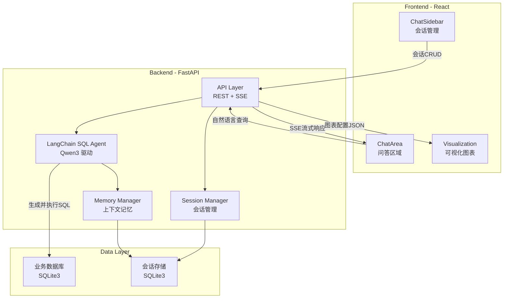
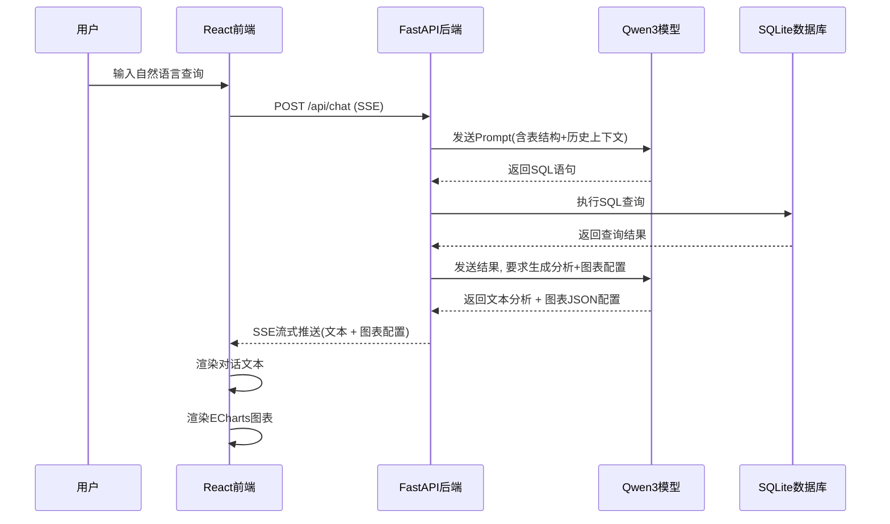
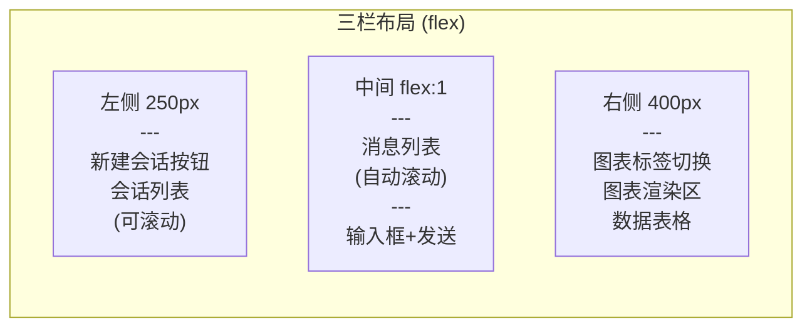

# 智能数据分析系统 - 系统模块规划

## 整体架构



## 数据流



---

## 一、后端模块设计 (backend/)

### 1.1 项目结构

```
backend/
  main.py                  # FastAPI 入口, CORS, 路由挂载
  config.py                # 配置管理(API Key, 数据库路径等)
  requirements.txt         # Python 依赖
  api/
    __init__.py
    chat.py                # 聊天接口(SSE流式响应)
    session.py             # 会话管理接口(CRUD)
    database.py            # 数据库管理接口(上传/查看表结构)
  core/
    __init__.py
    llm.py                 # Qwen3 LLM 初始化(阿里云百炼 DashScope)
    agent.py               # LangChain SQL Agent 核心逻辑
    memory.py              # 对话上下文记忆管理
    prompts.py             # Prompt模板定义
    chart_parser.py        # 图表配置解析(从LLM输出提取图表JSON)
  db/
    __init__.py
    connection.py          # SQLite 连接管理(业务库)
    session_store.py       # 会话与消息持久化(会话库)
    init_db.py             # 数据库初始化脚本
  models/
    __init__.py
    schemas.py             # Pydantic 请求/响应模型
```

### 1.2 核心模块说明

**config.py** - 环境配置
- 阿里云百炼 API Key (`DASHSCOPE_API_KEY`)
- 模型名称: `qwen3.6-plus` (实测验证可用)
- DashScope OpenAI 兼容 Base URL: `https://dashscope.aliyuncs.com/compatible-mode/v1`
- SQLite 业务数据库路径
- 会话数据库路径

**core/llm.py** - LLM 接入层
- 使用 `langchain_openai.ChatOpenAI` + DashScope OpenAI 兼容接口接入 (实测验证: `ChatTongyi` 不支持 `qwen3.6-plus` 模型名)
- Base URL: `https://dashscope.aliyuncs.com/compatible-mode/v1`
- 配置模型参数: temperature, max_tokens 等
- 注意: 模型默认开启思维链 (Thinking Mode), 需根据场景决定是否关闭

**core/agent.py** - SQL Agent 核心
- 使用 LangChain 的 `create_sql_agent` 构建 SQL 智能体
- Agent 工作流:
  1. 接收用户自然语言 + 历史上下文
  2. 自动获取数据库表结构 (schema)
  3. 生成 SQL 并执行
  4. 对查询结果进行分析
  5. 根据数据特征生成 ECharts 图表配置 JSON
- 关键依赖: `langchain.agents.agent_toolkits.SQLDatabaseToolkit`

**core/memory.py** - 上下文记忆
- 基于 `ConversationBufferWindowMemory` 实现滑动窗口记忆(保留最近 N 轮对话)
- 每个 session 独立维护一份 memory 实例
- 会话切换时从数据库加载历史消息重建 memory

**core/prompts.py** - Prompt 模板
- 系统提示词: 定义 Agent 角色(数据分析专家)
- 约束 SQL 生成规则(只读查询、安全限制)
- 定义图表配置输出格式规范(标准 ECharts option JSON)

**core/chart_parser.py** - 图表解析
- 从 LLM 的自由文本输出中提取结构化的图表配置
- 使用 JSON 解析 + 正则兜底
- 支持的图表类型: bar(柱状图), line(折线图), pie(饼图), scatter(散点图), table(表格)

**api/chat.py** - 聊天接口
- `POST /api/chat` - SSE (Server-Sent Events) 流式响应
- 请求体: `{ session_id, message }`
- SSE 事件类型:
  - `text`: 流式文本片段
  - `sql`: 生成的 SQL 语句
  - `chart`: 图表配置 JSON
  - `error`: 错误信息
  - `done`: 完成标记

**api/session.py** - 会话管理
- `GET /api/sessions` - 获取会话列表
- `POST /api/sessions` - 创建新会话
- `GET /api/sessions/{id}` - 获取会话详情(含历史消息)
- `PUT /api/sessions/{id}` - 更新会话标题
- `DELETE /api/sessions/{id}` - 删除会话

**api/database.py** - 数据库管理
- `GET /api/database/tables` - 获取所有表及结构
- `POST /api/database/upload` - 上传 CSV/Excel 导入数据
- `GET /api/database/preview/{table}` - 预览表数据

**db/session_store.py** - 会话持久化
- sessions 表: id, title, created_at, updated_at
- messages 表: id, session_id, role, content, sql, chart_config, created_at

### 1.3 关键依赖

```
fastapi
uvicorn
langchain                      # 核心框架, 提供 create_agent
langchain-openai               # 通过 ChatOpenAI + DashScope 兼容接口接入 Qwen3
langchain-community            # 提供 SQLDatabase, SQLDatabaseToolkit
langgraph                      # create_agent 底层依赖 (ReAct Agent 运行时)
sqlalchemy
pydantic
pydantic-settings
python-dotenv
sse-starlette
python-multipart
pandas
openpyxl
```

---

## 二、前端模块设计 (frontend/)

### 2.1 项目结构

```
frontend/
  public/
  src/
    App.tsx                # 根组件, 三栏布局
    main.tsx               # 入口
    components/
      ChatSidebar/
        index.tsx          # 左侧栏容器
        SessionList.tsx    # 会话列表
        SessionItem.tsx    # 单个会话项
      ChatArea/
        index.tsx          # 中间聊天区域容器
        MessageList.tsx    # 消息列表
        MessageItem.tsx    # 单条消息(支持Markdown渲染)
        ChatInput.tsx      # 输入框 + 发送按钮
        SqlBlock.tsx       # SQL代码高亮展示块
      Visualization/
        index.tsx          # 右侧可视化容器
        ChartPanel.tsx     # 单个图表面板
        ChartRenderer.tsx  # ECharts 渲染器
        DataTable.tsx      # 数据表格展示
    services/
      api.ts               # Axios 封装
      chatService.ts       # 聊天相关API + SSE处理
      sessionService.ts    # 会话CRUD
      databaseService.ts   # 数据库管理API
    store/
      index.ts             # Zustand store 入口
      chatStore.ts         # 聊天状态(当前会话、消息列表)
      sessionStore.ts      # 会话列表状态
      chartStore.ts        # 图表状态管理
    types/
      index.ts             # 类型定义(Message, Session, ChartConfig等)
    styles/
      global.css           # 全局样式
    hooks/
      useSSE.ts            # SSE 连接自定义Hook
      useAutoScroll.ts     # 自动滚动Hook
```

### 2.2 UI 布局



### 2.3 核心组件说明

**ChatSidebar** - 左侧会话管理
- 顶部「新建对话」按钮
- 会话列表: 按时间倒序排列, 显示标题和时间
- 支持: 点击切换、右键重命名、删除
- 当前活跃会话高亮

**ChatArea** - 中间问答区域
- 消息气泡区分用户/AI
- AI 消息支持 Markdown 渲染 (使用 `react-markdown`)
- SQL 代码块高亮展示 (使用 `react-syntax-highlighter`)
- 流式文本逐字显示效果
- 底部固定输入框, 支持 Enter 发送 / Shift+Enter 换行
- 加载状态提示

**Visualization** - 右侧可视化
- 使用 `echarts-for-react` 渲染图表
- 支持多图表标签切换(同一会话中多次查询产生的图表)
- 每次 AI 返回图表配置时自动添加新图表
- 支持图表全屏查看
- 底部数据表格展示原始查询结果

### 2.4 SSE 流式处理

前端通过 `EventSource` 或 `fetch + ReadableStream` 接收后端 SSE 推送:

```typescript
// 伪代码: SSE 处理流程
const response = await fetch('/api/chat', { method: 'POST', body });
const reader = response.body.getReader();

// 逐块读取
while (true) {
  const { done, value } = await reader.read();
  if (done) break;
  
  const events = parseSSE(decode(value));
  for (const event of events) {
    switch (event.type) {
      case 'text':    appendToMessage(event.data); break;
      case 'sql':     setSqlBlock(event.data); break;
      case 'chart':   addChart(JSON.parse(event.data)); break;
      case 'done':    finalize(); break;
    }
  }
}
```

### 2.5 关键依赖

- `react` + `react-dom` + `typescript`
- `zustand` - 轻量状态管理
- `echarts` + `echarts-for-react` - 图表渲染
- `react-markdown` + `remark-gfm` - Markdown 渲染
- `react-syntax-highlighter` - SQL 代码高亮
- `axios` - HTTP 请求
- `antd` - UI 组件库 (按钮、输入框、布局、消息提示等)
- `dayjs` - 时间格式化

---

## 三、数据库设计

### 3.1 会话存储库 (sessions.db)

**sessions 表**
- `id` TEXT PRIMARY KEY - UUID
- `title` TEXT - 会话标题(首次提问自动生成)
- `created_at` DATETIME
- `updated_at` DATETIME

**messages 表**
- `id` TEXT PRIMARY KEY - UUID
- `session_id` TEXT - 外键关联 sessions
- `role` TEXT - "user" | "assistant"
- `content` TEXT - 消息文本内容
- `sql` TEXT - 生成的SQL(可为空)
- `chart_config` TEXT - 图表配置JSON(可为空)
- `created_at` DATETIME

### 3.2 业务数据库 (business.db)

- 由用户通过 CSV/Excel 上传导入
- 或者预置示例数据集(如销售数据、员工信息等)
- Agent 只对此库执行**只读查询**

---

## 四、安全设计

- SQL Agent 限制为**只读操作** (SELECT ONLY)，在 Prompt 层和代码层双重限制
- LLM API Key 存储在 `.env` 文件中，不提交到版本控制
- 前后端通过 CORS 白名单控制访问
- SQL 注入防护: 通过 SQLAlchemy 参数化查询 + Agent 沙箱执行

---

## 五、实施顺序

分 4 个阶段递进实施:

### Phase 1: 搭建基础骨架 + 运行验证

目标: 前后端项目能分别独立启动运行，确认开发环境就绪。

**后端 (backend/)**
- 初始化项目目录结构 (api/, core/, db/, models/)
- 创建 `main.py` FastAPI 入口，配置 CORS
- 创建 `config.py` 环境配置 (读取 .env)
- 创建 `requirements.txt` 安装所有依赖
- 编写一个健康检查接口 `GET /api/health` 验证服务启动
- 启动 uvicorn 验证: `uvicorn main:app --reload --port 8000`

**前端 (frontend/)**
- 使用 Vite 初始化 React + TypeScript 项目
- 安装核心依赖: antd, zustand, echarts, react-markdown 等
- 创建基础 `App.tsx` 占位页面
- 启动 dev server 验证: `npm run dev`

**验收标准**: 后端 `http://localhost:8000/api/health` 返回 200; 前端 `http://localhost:5173` 显示页面

---

### Phase 2: 研发前端 UI (Mock 数据驱动)

目标: 完成所有前端 UI 组件的开发，使用 Mock 数据驱动，不依赖后端接口。

**基础设施**
- 定义 TypeScript 类型 (types/index.ts): Session, Message, ChartConfig
- 搭建 Zustand Store (chatStore, sessionStore, chartStore)
- 创建 Mock 数据服务层 (services/ 下返回模拟数据)

**三栏布局 (App.tsx)**
- 左侧固定宽度 250px - ChatSidebar
- 中间自适应 flex:1 - ChatArea
- 右侧固定宽度 400px - Visualization

**ChatSidebar 组件**
- 顶部「新建对话」按钮
- 会话列表 (Mock 2-3 条会话)，按时间倒序
- 点击切换高亮、删除功能

**ChatArea 组件**
- 消息列表: 用户气泡 + AI 气泡样式区分
- AI 消息内 Markdown 渲染 (react-markdown)
- SQL 代码块高亮 (react-syntax-highlighter)
- 底部输入框: Enter 发送 / Shift+Enter 换行
- Mock 模拟流式打字效果

**Visualization 组件**
- ECharts 图表渲染 (echarts-for-react)
- 多图表 Tab 切换
- 数据表格 (antd Table)
- 使用 Mock 数据渲染柱状图/折线图/饼图示例

**验收标准**: 所有 UI 组件在 Mock 数据下可正常交互、展示

---

### Phase 3: 研发后端接口

目标: 完成所有后端 API 接口的开发，可通过 Swagger UI 或 curl 独立测试。

#### 3.0 Qwen3 模型接入字段规范 (已通过实测验证)

> 以下所有字段结构均基于 `qwen3.6-plus` 模型 + DashScope OpenAI 兼容接口实测确认
> 测试代码: `backend/test_qwen.py`

**接入方式**: 必须使用 `langchain_openai.ChatOpenAI` + DashScope 兼容端点（`ChatTongyi` 不支持 `qwen3.6-plus` 模型名）

```python
from langchain_openai import ChatOpenAI

llm = ChatOpenAI(
    model="qwen3.6-plus",
    base_url="https://dashscope.aliyuncs.com/compatible-mode/v1",
    api_key=os.environ["DASHSCOPE_API_KEY"],
)
```

**3.0.1 基础调用 (invoke) 返回字段**

返回类型: `AIMessage`

| 字段 | 类型 | 说明 |
|------|------|------|
| `content` | `str` | 模型的文本回答内容 |
| `id` | `str` | LangChain 运行 ID, 格式 `lc_run--{uuid}-0` |
| `response_metadata.token_usage.completion_tokens` | `int` | 输出 token 总数(含 reasoning) |
| `response_metadata.token_usage.prompt_tokens` | `int` | 输入 token 数 |
| `response_metadata.token_usage.total_tokens` | `int` | 总 token 数 |
| `response_metadata.token_usage.completion_tokens_details.reasoning_tokens` | `int` | **思维链推理消耗的 token 数** |
| `response_metadata.token_usage.completion_tokens_details.text_tokens` | `int` | 实际文本输出 token 数 |
| `response_metadata.model_name` | `str` | `"qwen3.6-plus"` |
| `response_metadata.finish_reason` | `str` | `"stop"` 正常结束 / `"tool_calls"` 工具调用 |
| `response_metadata.id` | `str` | DashScope 请求 ID, 格式 `chatcmpl-{uuid}` |
| `usage_metadata.output_token_details.reasoning` | `int` | 推理 token 数 (同上) |
| `additional_kwargs.refusal` | `null` | 拒绝标记, 正常为 null |

**3.0.2 流式输出 (stream) chunk 字段**

返回类型: `AIMessageChunk`

| 字段 | 类型 | 说明 |
|------|------|------|
| `content` | `str` | 文本片段, **思维链阶段为空字符串 `""`** |
| `id` | `str` | 同一次流共享同一个 run ID |
| `response_metadata` | `dict` | 中间 chunk 仅含 `{"model_provider": "openai"}`; 最后一个有效 chunk 含 `finish_reason` + `model_name` |

⚠️ **关键行为: qwen3.6-plus 默认开启思维链 (Thinking Mode)**
- 流式输出开头会产生**大量 `content=''` 的空 chunk** (实测: 630+ 个空 chunk, 仅 8 个有内容 chunk)
- 这些空 chunk 对应模型内部推理过程 (`reasoning_tokens`)
- SSE 推送时**必须过滤 `content == ''` 的 chunk**, 仅推送有实际内容的文本片段
- 如需关闭思维链以降低延迟和 token 消耗, 可传 `model_kwargs={"extra_body": {"enable_thinking": False}}`

**3.0.3 Tool Calling 返回字段**

触发工具调用时, `content` 为空字符串, 数据在 `tool_calls` 中:

| 字段 | 类型 | 说明 |
|------|------|------|
| `content` | `str` | 空字符串 `""` |
| `tool_calls` | `list[dict]` | 工具调用列表 |
| `tool_calls[].name` | `str` | 工具名称 (如 `"get_weather"`) |
| `tool_calls[].args` | `dict` | 工具参数 (如 `{"city": "北京"}`) |
| `tool_calls[].id` | `str` | 调用 ID, 格式 `call_{24位hex}` |
| `tool_calls[].type` | `str` | 固定 `"tool_call"` |
| `response_metadata.finish_reason` | `str` | **`"tool_calls"`** (区别于正常的 `"stop"`) |
| `additional_kwargs.refusal` | `null` | 正常为 null |

**3.0.4 流式 + Tool Calling chunk 字段**

工具调用在流式模式下的 chunk 分片规则:

| 阶段 | chunk 特征 |
|------|-----------|
| 思维链阶段 | `content=''`, `tool_call_chunks=[]` (空列表, 共 ~80 个 chunk) |
| 工具名称到达 | `tool_call_chunks=[{name: "get_weather", args: "", id: "call_xxx", index: 0}]` |
| 参数分片到达 | `tool_call_chunks=[{name: None, args: '{"city": "上海"', id: "", index: 0}]` |
| 参数续片 | `tool_call_chunks=[{name: None, args: '"', id: "", index: 0}]` |
| 参数闭合 | `tool_call_chunks=[{name: None, args: '}', id: "", index: 0}]` |
| 结束 | `tool_call_chunks=[]` |

工具调用参数需**累积拼接 `args` 字段**直到形成完整 JSON。

**3.0.5 开发约束汇总**

1. **接入方式**: 使用 `ChatOpenAI(base_url=DASHSCOPE_URL)`, 不用 `ChatTongyi`
2. **空 chunk 过滤**: 流式推送 SSE 时, 跳过 `content == ""` 且无 `tool_call_chunks` 的 chunk
3. **finish_reason 判断**: `"stop"` = 正常文本, `"tool_calls"` = 需要执行工具
4. **token 成本**: 思维链模式下 `reasoning_tokens` 远大于 `text_tokens`, 需在成本监控中区分
5. **依赖包**: `langchain-openai` (非 `dashscope` SDK), 通过 `pip install langchain-openai`

---

#### 3.1 NL2SQL 组件与字段规范 (已通过实测验证)

> 以下所有字段结构均基于 `create_agent` + `SQLDatabaseToolkit` + `qwen3.6-plus` 实测确认
> 测试代码: `backend/test_nl2sql.py`

**方案选型**: `create_agent` (LangChain v1) + `SQLDatabaseToolkit` (langchain-community)
- 安装: `pip install langchain langchain-community langchain-openai langgraph`
- 底层基于 LangGraph ReAct Agent, 自动循环调用工具直到生成最终回答

**3.1.1 核心组件初始化**

```python
from langchain_community.utilities import SQLDatabase
from langchain_community.agent_toolkits import SQLDatabaseToolkit
from langchain.agents import create_agent
from langchain_openai import ChatOpenAI

db = SQLDatabase.from_uri("sqlite:///business.db")
llm = ChatOpenAI(
    model="qwen3.6-plus",
    base_url="https://dashscope.aliyuncs.com/compatible-mode/v1",
    api_key=os.environ["DASHSCOPE_API_KEY"],
)
toolkit = SQLDatabaseToolkit(db=db, llm=llm)
tools = toolkit.get_tools()
agent = create_agent(llm, tools, system_prompt=SYSTEM_PROMPT)
```

**SQLDatabase 关键方法:**

| 方法 | 返回 | 说明 |
|------|------|------|
| `SQLDatabase.from_uri(uri)` | `SQLDatabase` | 连接数据库, 支持 `sqlite:///xxx.db` |
| `db.dialect` | `str` | `"sqlite"` |
| `db.get_usable_table_names()` | `list[str]` | `['products', 'sales']` |
| `db.get_table_info()` | `str` | DDL + 3 行示例数据 (自动生成) |

**3.1.2 SQLDatabaseToolkit 生成的 4 个工具**

| 工具名 | args 结构 | 返回值 (str) | 用途 |
|--------|----------|-------------|------|
| `sql_db_list_tables` | `{"tool_input": ""}` | `"products, sales"` | 列出所有表名 |
| `sql_db_schema` | `{"table_names": "products, sales"}` | DDL + 示例行 | 获取表结构 |
| `sql_db_query_checker` | `{"query": "SELECT ..."}` | 检查后的 SQL 文本 | LLM 检查 SQL 正确性 |
| `sql_db_query` | `{"query": "SELECT ..."}` | `"[('电子产品', 165102.0), ...]"` | 执行 SQL 返回结果 |

**3.1.3 Agent 执行流程 (stream_mode="updates")**

Agent 以 `model` / `tools` 两个节点交替执行, 每个 step 的结构:

```python
# step 结构:
{
    "model": {              # 或 "tools"
        "messages": [msg]   # 单条 AIMessage 或 ToolMessage
    }
}
```

**实测完整执行序列 (9 步):**

| Step | 节点 | 消息类型 | 关键内容 |
|------|------|---------|---------|
| 1 | `model` | `AIMessage` | `content=""`, `tool_calls=[{name:"sql_db_list_tables", args:{"tool_input":""}, id:"call_xxx"}]`, `finish_reason:"tool_calls"` |
| 2 | `tools` | `ToolMessage` | `content="products, sales"`, `tool_name:"sql_db_list_tables"`, `tool_call_id:"call_xxx"` |
| 3 | `model` | `AIMessage` | `tool_calls=[{name:"sql_db_schema", args:{"table_names":"products, sales"}}]` |
| 4 | `tools` | `ToolMessage` | `content="CREATE TABLE products..."` (DDL + 示例) |
| 5 | `model` | `AIMessage` | `tool_calls=[{name:"sql_db_query_checker", args:{"query":"SELECT ..."}}]` |
| 6 | `tools` | `ToolMessage` | `content="SELECT ..."` (检查通过的 SQL) |
| 7 | `model` | `AIMessage` | `tool_calls=[{name:"sql_db_query", args:{"query":"SELECT ..."}}]` |
| 8 | `tools` | `ToolMessage` | `content="[('电子产品', 165102.0), ...]"` (查询结果) |
| 9 | `model` | `AIMessage` | `content="各商品类别总销售额..."`, `finish_reason:"stop"` (最终回答) |

**3.1.4 消息类型字段详解**

**AIMessage (model 节点输出) - 工具调用阶段:**

| 字段 | 值 |
|------|-----|
| `content` | `""` (空) |
| `tool_calls[].name` | `"sql_db_list_tables"` / `"sql_db_schema"` / `"sql_db_query_checker"` / `"sql_db_query"` |
| `tool_calls[].args` | `dict` (见 3.1.2 各工具 args) |
| `tool_calls[].id` | `"call_{24位hex}"` |
| `response_metadata.finish_reason` | `"tool_calls"` |
| `usage_metadata` | `{'input_tokens': N, 'output_tokens': N, 'output_token_details': {'reasoning': N}}` |

**AIMessage (model 节点输出) - 最终回答:**

| 字段 | 值 |
|------|-----|
| `content` | 自然语言回答文本 |
| `tool_calls` | `[]` (空) |
| `response_metadata.finish_reason` | `"stop"` |
| `response_metadata.token_usage` | 完整 token 统计 |

**ToolMessage (tools 节点输出):**

| 字段 | 类型 | 说明 |
|------|------|------|
| `content` | `str` | 工具执行结果 (纯文本, 查询结果为 Python repr 格式) |
| `name` | `str` | 工具名称 |
| `tool_call_id` | `str` | 对应 AIMessage 中 `tool_calls[].id` |

**3.1.5 stream_mode="values" 的 state 结构**

```python
# 最终 state:
{
    "messages": [
        HumanMessage,    # 用户问题
        AIMessage,       # tool_calls: sql_db_list_tables
        ToolMessage,     # "products, sales"
        AIMessage,       # tool_calls: sql_db_schema
        ToolMessage,     # DDL
        AIMessage,       # tool_calls: sql_db_query_checker
        ToolMessage,     # checked SQL
        AIMessage,       # tool_calls: sql_db_query
        ToolMessage,     # query results
        AIMessage,       # 最终自然语言回答 (finish_reason: "stop")
    ]
}
```

消息类型序列: `['HumanMessage', 'AIMessage', 'ToolMessage', 'AIMessage', 'ToolMessage', 'AIMessage', 'ToolMessage', 'AIMessage', 'ToolMessage', 'AIMessage']`

**3.1.6 SSE 推送策略 (api/chat.py 关键逻辑)**

基于上述实测结果, `api/chat.py` 的 SSE 推送策略:

| Agent Step | 节点 | SSE 事件 | 推送内容 |
|------------|------|---------|---------|
| model + `finish_reason:"tool_calls"` | model | **不推送** | Agent 内部工具调用, 前端不感知 |
| `sql_db_query` 的 ToolMessage | tools | **`sql` 事件** | 提取 step 5/7 中的 SQL 语句推送给前端 |
| `sql_db_query` 结果 ToolMessage | tools | **`data` 事件** (可选) | 原始查询结果, 供前端数据表格展示 |
| model + `finish_reason:"stop"` | model | **`text` 事件** | 最终自然语言回答, 流式推送 |
| 图表配置 (从最终回答中解析) | - | **`chart` 事件** | ECharts option JSON |
| 全部完成 | - | **`done` 事件** | 结束标记 |

**3.1.7 开发约束汇总**

1. **依赖**: `langchain` + `langchain-community` + `langchain-openai` + `langgraph`
2. **Agent API**: 使用 `create_agent` (非已废弃的 `create_sql_agent`)
3. **流式模式**: 使用 `stream_mode="updates"` 逐步获取各节点输出, 便于按节点类型推送不同 SSE 事件
4. **SQL 提取**: 从 `tool_calls[].args.query` 字段提取生成的 SQL (step 5 或 step 7)
5. **结果提取**: 从 `ToolMessage.content` 获取查询结果 (Python repr 字符串, 需解析)
6. **最终回答判断**: `finish_reason == "stop"` 且 `content != ""` 时为最终回答
7. **reasoning_tokens**: 每一步 model 调用都有 reasoning 开销, 多轮工具调用累积 token 较高

---

**LLM 接入 (core/llm.py)**
- 通过 `ChatOpenAI` + DashScope OpenAI 兼容接口接入阿里云百炼 Qwen3
- 配置 `base_url`: `https://dashscope.aliyuncs.com/compatible-mode/v1`
- 配置 `model`: `qwen3.6-plus`
- 遵循 3.0 字段规范处理所有输入输出

**SQL Agent (core/agent.py)**
- 使用 `create_agent` + `SQLDatabaseToolkit` (遵循 3.1 NL2SQL 字段规范)
- 自动执行: list_tables → schema → query_checker → query → 生成回答 (共 9 步)
- `stream_mode="updates"` 获取逐步输出, 用于 SSE 事件分类推送
- 从 `tool_calls[].args.query` 提取 SQL, 从 `ToolMessage.content` 提取查询结果

**图表生成 (core/chart_parser.py + core/prompts.py)**
- Prompt 模板要求 LLM 在最终回答中输出标准 ECharts option JSON
- 解析器从 AIMessage.content (finish_reason="stop") 中提取图表配置

**会话管理 (api/session.py + db/session_store.py)**
- 初始化会话数据库 (sessions + messages 表)
- 实现会话 CRUD 接口

**上下文记忆 (core/memory.py)**
- ConversationBufferWindowMemory 滑动窗口
- 按 session_id 隔离，支持从数据库恢复

**聊天接口 (api/chat.py)**
- SSE 流式响应完整链路, 遵循 3.1.6 SSE 推送策略
- 使用 `agent.stream(input, stream_mode="updates")` 获取逐步输出
- 按节点类型 (`model`/`tools`) 和 `finish_reason` 分类推送不同 SSE 事件
- 事件类型: text / sql / data / chart / error / done

**数据库管理 (api/database.py)**
- CSV/Excel 上传导入
- 查看表结构、预览数据

**验收标准**: 所有接口可通过 FastAPI Swagger UI (`/docs`) 独立测试通过

---

### Phase 4: 前后端联调 + 体验打磨

目标: 将前端 Mock 替换为真实 API 调用，端到端跑通完整流程。

**替换 Mock 为真实 API**
- services/ 层从 Mock 切换到 axios 调用后端
- 接入 SSE 流式处理 (fetch + ReadableStream)

**会话管理联调**
- 创建/切换/删除会话
- 切换会话时加载历史消息

**可视化联调**
- 真实 LLM 输出的图表配置渲染
- 数据表格展示查询原始结果

**体验打磨**
- 全局错误处理 + 友好提示
- Loading / Streaming 状态展示
- 空状态引导 (无会话、无图表时)
- 响应式适配、UI 细节调整
